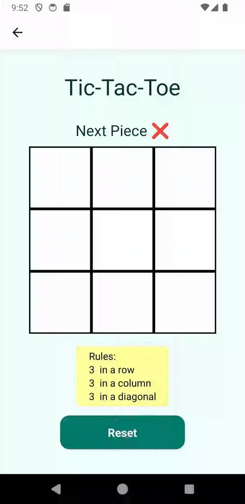

# TDT4250 - Group 7 - Final project

The project aims to develop a DSL, and related infrastructure, for creating board games such as Tic-tac-toe, Sudoku and Chess. The group focused on variability aspects related to the rules, as well as board size and piece types and number of players. Due to time constrains and complexity of the problem, the group has prioritized on tic-tac-toe type games, but a description of our planned board game model is in (*HVOR MODELLBESKRIVELSE LIGGER*)  

The resulting code is compiled to JavaScript files, that can be copied into the react project. This project is in the folder and includes an example game in the folder:  

*final-project-group07/Application*

**System requirements:**
- Eclipse (to view and edit the project, as well as using DSL)
   - Version: Eclipse IDE version 2024-06 for Java and DSL Developers
   - Using additional plugins: EMF Forms SDK, Ecore Diagram Editor
- Android studio (To run and emulate finished application)

### Project structure 
- **Model code** :  final-project-group07/BoardGame 
- **Core package** : no.ntnu.tdt4250.g07.bg 
- **Boardgame plugin extension** : .bg 
- **Boardgame DSL extension** : .bgdl 

**Metamodel (Ecore):**
- Path: *BoardGame/no.ntnu.tdt4250.g07.bg/model/bg.ecore*
- Example model instances: *BoardGame/no.ntnu.tdt4250.g07.bg.examples/*

**Grammar definition (Xtext):**
- Path: *BoardGame/no.ntnu.tdt4250.g07.bg.bgdl/bin/no/ntnu/tdt4250/g07/bg/bgdl/BoardgameDL.xtext*

**Code generation rules (Xtend):**
- Path: *BoardGame/no.ntnu.tdt4250.g07.bg.bgdl/src/no/ntnu/tdt4250/g07/bg/bgdl/generator/BoardGameDLGenerator.xtend*

**Example project (.bgdl):**
- Path: *Xtext-examples/examplesXtext/bin/test.bgdl*

**Generated code (JavaScript/React):**
- The model automatically generates code when saving the Xtext files and places it in the folder:
Path: *Xtext-examples/examplesXtext/src-gen*

## How to open project: 
Open the following folders in an Eclipse workspace: *final-project-group07/BoardGame*

**To create or open board game, Open this folder in another workspace:** 

Path: *final-project-group07/ Xtext-examples/examplesXtext*

 
**An example implementation of Tic-tac-toe is found in the file:**

The project automatically compiles to react code when saving the file. 
Create a file with the file ending “.bgdl” to use the language. 

 

### Resulting code: 

To test out the code, you need to place it inside the React application. 

Generated files location: *Xtext-examples/examplesXtext/src-gen*

**Where to place generated files:**

- boardGame.js : Application/src-gen 

- Config.js: Application/src-gen 

- winConditions.js : Application/src-gen 

- BoardStyles.js : Application/src-gen 

 
