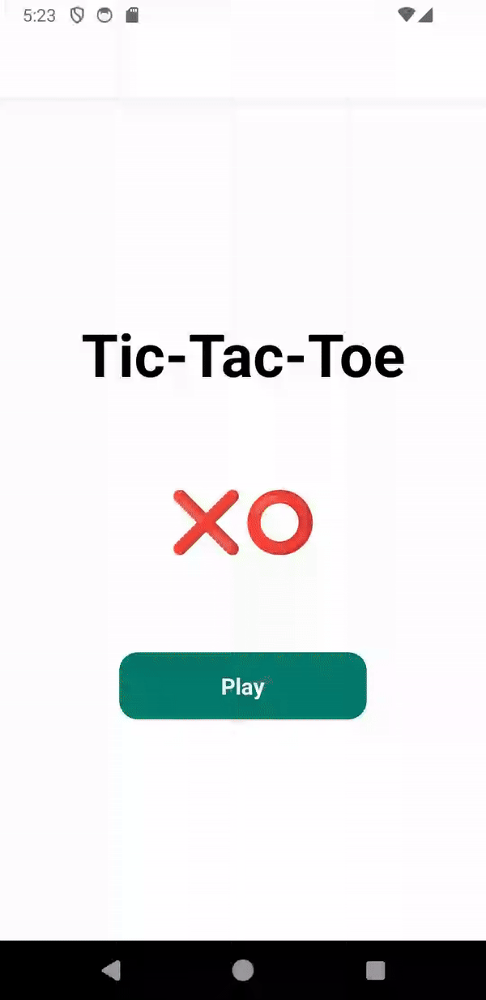
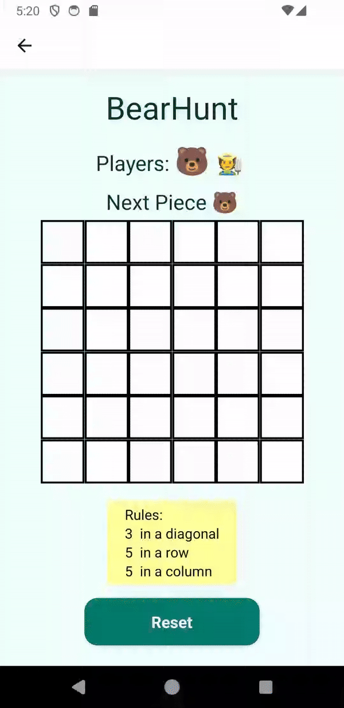

# TDT4250 - Group 7 - Final project

The project aims to develop a DSL, and related infrastructure, meant for creating board games such as Tic-tac-toe, Sudoku and Chess. The group focused on variability aspects related to the rules, as well as board size and piece types and number of players. Due to time constrains and complexity of the problem, the group has prioritized on tic-tac-toe type games, while ensuring the project remains extensible for future improvements. A description of our initially planned board game model is in (*HVOR MODELLBESKRIVELSE LIGGER*)  

The resulting code is compiled to JavaScript files, that can be copied into the react project. This project is in the folder and includes an example game in the folder:  

*final-project-group07/Application*
<div style="display: flex; justify-content: center; text-align:center">



</div>

## **System requirements:**
- Eclipse (to view and edit the project, as well as using DSL)
   - Version: Eclipse IDE version 2024-06 for Java and DSL Developers
   - Using additional plugins: EMF Forms SDK, Ecore Diagram Editor
- Android studio (To run and emulate finished application)

## Project structure 

```
+---Application
|   +---src-gen                                                \\ Location for generated files
+---BoardGame
|   +---no.ntnu.tdt4250.g07.bg
|   |   +---model
|   |   |   +---bg.ecore                                       \\ Ecore Metamodel
|   +---no.ntnu.tdt4250.g07.bg.bgdl
|   |   +---src\no\ntnu\tdt4250\g07\bg\bgdl
|   |	|                           +---BoardGameDL.xtext      \\ Concrete syntax defenition
|   |   |                           +---generator              \\ Code generation rules
|   +---no.ntnu.tdt4250.g07.bg.bgdl.ide
|   +---no.ntnu.tdt4250.g07.bg.bgdl.tests
|   +---no.ntnu.tdt4250.g07.bg.bgdl.ui
|   +---no.ntnu.tdt4250.g07.bg.bgdl.ui.tests
|   +---no.ntnu.tdt4250.g07.bg.edit
|   +---no.ntnu.tdt4250.g07.bg.editor
|   \---no.ntnu.tdt4250.g07.bg.examples                        \\ Example model instances
\---Xtext-examples
    \---examplesXtext
        +---src                                                \\ Example DSL instances
        +---src-gen                                            \\ Generated code from DSL
```
- **Model code** :  final-project-group07/BoardGame 
- **Core package** : no.ntnu.tdt4250.g07.bg 
- **Boardgame plugin extension** : .bg 
- **Boardgame DSL extension** : .bgdl 

**Metamodel (Ecore):**
- Path: *BoardGame/no.ntnu.tdt4250.g07.bg/model/bg.ecore*
- Example model instances: *BoardGame/no.ntnu.tdt4250.g07.bg.examples/*

 **Constraints:**
- Path: *BoardGame/no.ntnu.tdt4250.g07.bg/src-gen/no/ntnu/tdt4250/g07/bg/util/BgValidator.java* 

 **DSL Concrete Syntax definition (Xtext):**
- Path: *BoardGame/no.ntnu.tdt4250.g07.bg.bgdl/bin/no/ntnu/tdt4250/g07/bg/bgdl/BoardgameDL.xtext*

**Code generation (Xtend):**
- Path: *BoardGame/no.ntnu.tdt4250.g07.bg.bgdl/src/no/ntnu/tdt4250/g07/bg/bgdl/generator/BoardGameDLGenerator.xtend*

**Example DSL insances (.bgdl):**
- Path: *Xtext-examples/examplesXtext/src/*

**Generated code (JavaScript/React):**
- The model automatically generates code when saving the Xtext files and places it in the folder:
Path: *Xtext-examples/examplesXtext/src-gen*

## How to open project: 
Open the following folders in an Eclipse workspace: *final-project-group07/BoardGame*

### **To generate code from DSL, open this folder in a runtime instance of Eclipse:** 

- Path: *final-project-group07/Xtext-examples/examplesXtext*
- Create a file with the file ending “.bgdl” to use the language. 
- The project automatically compiles to react code when saving the file. 

### Resulting code: 

To test out the code, you need to place it inside the React application. 

Generated files location: *Xtext-examples/examplesXtext/src-gen*


## **Where to place generated files:**
- boardGame.js : Application/src-gen 
- Config.js: Application/src-gen 
- winConditions.js : Application/src-gen 
- BoardStyles.js : Application/src-gen 

# About the project
### Metamodel
The metamodel consists of the following classes: 
- A root class boardgame that contains the other boardgame elements, that inherit from the BoardGameElement type to make it easier when defining the xtext grammar. 
- PieceType, that represents different pieces that are in the game. They have a name and are represented by a symbol in the game. These attributes must be unique, and each boardgame must have at least piece piece type defined. 
- ValidMove, which defines what a given piece type is allowed to do.  
- Condition, which a valid move can refer to multiple of, specifies what cellstate must be in place for the move to be allowed. 
- CellState, is just a representation of a state that a cell can be in. 
- WinCondition, which represents all the different ways one can win, meaning if a board has for example 3 win conditions, either one of them will lead to a win. 
- Line, represents a set of pieces of a given length, which could be either horizontal, vertical or diagonal. Within a given win condition, all the lines must be in place the win condition to evaluate to a win. 
- EffectOnCell, represents how a given piece types affects the cells it is on or around it. A piece can have multiple effects, such that it can affect for example all the cells around it. 

### Constraints
- To ensure that the user only creates valid instances of the board game, a number of constraints have been enforced in the metamodel: 
- Because the game needs to fit on a phone screen, the board size is limited to a max board size of 10. 
- The board size needs to be at least 2. 
- All pieces must be unique (both name and symbol), and the symbol must be non-empty. 
- The win-conditions cannot require a sequence of pieces larger than the size of the board, and it must be greater than one. 
- There must be at least one win-condition.

### Concrete syntax
Location: *final-project-group07/BoardGame/no.ntnu.tdt4250.g07.bg.bgdl/no/ntnu/tdt4250/* 
The grammar of the DSL has been defined using Xtext by importing the Ecore model. It has been customized to make it quick and easy to create new instances of a board game, by defining the board size, available pieces and rules of the game expressed as win conditions and possible moves. See example instances, and the xtext file itself. 

### Code generation
Location: *BoardGame/no.ntnu.tdt4250.g07.bg.bgdl/src/no/ntnu/tdt4250/g07/bg/bgdl/generator/BoardGameDLGenerator.xtend* 
Xtend has been used to generate the code for the application. The generator analyzes the boardgame instance defined by the user, and alters some files that are used by the application. This ensures that the size of the board is dynamically updated to correspond with the specified instance, as well as which pieces are available in the game and what moves are legal for them. When the application checks if any of the players has won, it checks a number of conditions. The generator is however ensuring that only the necessary win condition checking functions are generated, to avoid having redundant code present in the app. If the user specifies all possible win conditions, more code is being generated. 

There are four files that are generated with Xtend, and need to be copied to the Application/src-gen folder in the source code for the application to work: 

boardGame.js, boardStyles.js, config.js and winCondition.js 
