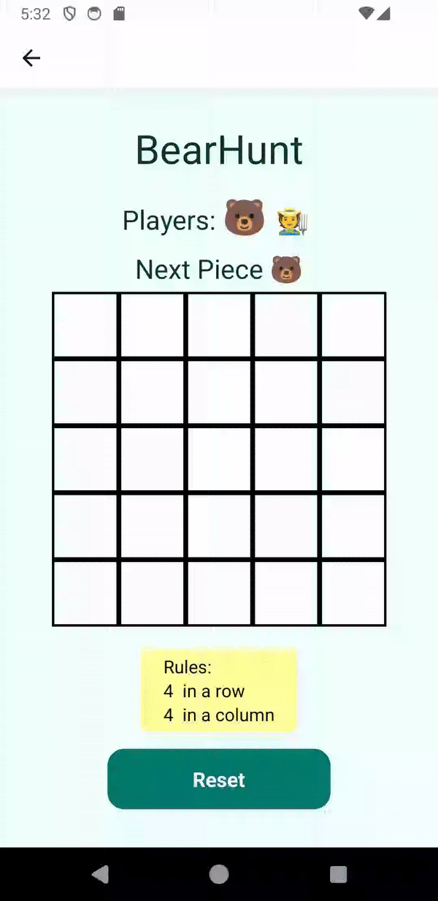

# TDT4250 - Group 7 - Final project

The project aims to develop a DSL, and related infrastructure, meant for creating board games such as Tic-tac-toe, Sudoku and Chess. The group focused on variability aspects related to the rules, as well as board size and piece types and number of players. Due to time constrains and complexity of the problem, the group has prioritized on tic-tac-toe type games, while ensuring the project remains extensible for future improvements. A description of our initially planned board game model is in (*HVOR MODELLBESKRIVELSE LIGGER*)  

The resulting code is compiled to JavaScript files, that can be copied into the React Native project. This project is in the folder and includes an example game in the folder:  

*final-project-group07/Application*
<div style="display: flex; justify-content: center; text-align:center">



</div>

## **System requirements:**
- Eclipse (to view and edit the project, as well as using DSL)
   - Version: Eclipse IDE version 2024-06 for Java and DSL Developers
   - Using additional plugins: EMF Forms SDK, Ecore Diagram Editor
- Android studio (To run and emulate finished application)

## Project structure 

```
+---Application
|   +---src-gen                                                \\ Location for generated files
+---BoardGame
|   +---no.ntnu.tdt4250.g07.bg
|   |   +---model
|   |   |   +---bg.ecore                                       \\ Ecore Metamodel
|   +---no.ntnu.tdt4250.g07.bg.bgdl
|   |   +---src\no\ntnu\tdt4250\g07\bg\bgdl
|   |	|                           +---BoardGameDL.xtext      \\ Concrete syntax defenition
|   |   |                           +---generator              \\ Code generation rules
|   +---no.ntnu.tdt4250.g07.bg.bgdl.ide
|   +---no.ntnu.tdt4250.g07.bg.bgdl.tests
|   +---no.ntnu.tdt4250.g07.bg.bgdl.ui
|   +---no.ntnu.tdt4250.g07.bg.bgdl.ui.tests
|   +---no.ntnu.tdt4250.g07.bg.edit
|   +---no.ntnu.tdt4250.g07.bg.editor
|   \---no.ntnu.tdt4250.g07.bg.examples                        \\ Example model instances
\---Xtext-examples
    \---examplesXtext
        +---src                                                \\ Example DSL instances
        +---src-gen                                            \\ Generated code from DSL
```
- **Model code** :  final-project-group07/BoardGame 
- **Core package** : no.ntnu.tdt4250.g07.bg 
- **Boardgame plugin extension** : .bg 
- **Boardgame DSL extension** : .bgdl 

**Metamodel (Ecore):**
- Path: *BoardGame/no.ntnu.tdt4250.g07.bg/model/bg.ecore*
- Example model instances: *BoardGame/no.ntnu.tdt4250.g07.bg.examples/*

 **Constraints:**
- Path: *BoardGame/no.ntnu.tdt4250.g07.bg/src-gen/no/ntnu/tdt4250/g07/bg/util/BgValidator.java* 

 **DSL Concrete Syntax definition (Xtext):**
- Path: *BoardGame/no.ntnu.tdt4250.g07.bg.bgdl/bin/no/ntnu/tdt4250/g07/bg/bgdl/BoardgameDL.xtext*

**Code generation (Xtend):**
- Path: *BoardGame/no.ntnu.tdt4250.g07.bg.bgdl/src/no/ntnu/tdt4250/g07/bg/bgdl/generator/BoardGameDLGenerator.xtend*

**Example DSL insances (.bgdl):**
- Path: *Xtext-examples/examplesXtext/src/*

**Generated code (JavaScript / React Native):**
- The model automatically generates code when saving the Xtext files and places it in the folder:
Path: *Xtext-examples/examplesXtext/src-gen*

## How to open project: 
Open the following folders in an Eclipse workspace: *final-project-group07/BoardGame*

### **To generate code from DSL, open this folder in a runtime instance of Eclipse:** 

- Path: *final-project-group07/Xtext-examples/examplesXtext*
- Create a file with the file ending “.bgdl” to use the language. 
- The project automatically compiles to React Native code when saving the file. 

### Resulting code: 

To test out the code, you need to place it inside the React Native application. 

Generated files location: *Xtext-examples/examplesXtext/src-gen*


## **Where to place generated files:**
- boardGame.js : Application/src-gen 
- Config.js: Application/src-gen 
- winConditions.js : Application/src-gen 
- BoardStyles.js : Application/src-gen

## Application installation
If you want to try to run the application itself, here is the procedure:

0. Copy the four generated files to the Application/src-gen folder
1. Make sure you have **Node.js** installed on your computer.
2. Open the Application/ folder in a terminal or in an IDE with an integrated terminal.
3. Run the command `npm install` to install all dependencies.
4. Run the command `npm start` to start the server.
5. Open the app in an emulator or on a physical device:
   - **Emulator**: 
     - Ensure you have an Android emulator installed on your system, such as through Android Studio.
     - To start the app, run the command `npm run android` or press `a`.
     - The app was developed using an emulator with **API version 34** and **Android 14**.
   - **Physical Device**: 
     - Download the app **Expo Go** on an Android or iOS device and scan the QR code in the terminal to connect.
     - The app has been tested on a device running **Android 14**


# About the project
### Metamodel
<div style="display: flex; justify-content: center; text-align:center">

</div>
The metamodel consists of the following classes:  
- A root class **BoardGame** that contains the other boardgame elements, that inherit from the `BoardGameElement` type to make it easier when defining the xtext grammar.  
- **PieceType**, that represents different pieces that are in the game. They have a name and are represented by a symbol in the game. These attributes must be unique, and each boardgame must have at least one piece type defined. Implicitly, each piece can be placed at any type of cell, and hence each piece type has defined the disallowed states it cannot be placed on.  
- **CellState**, is just a representation of a state that a cell can be in.  
- **WinCondition**, which represents all the different ways one can win, meaning if a board has, for example, 3 win conditions, either one of them will lead to a win.  
- **Line**, represents a set of pieces of a given length, which could be either horizontal, vertical, or diagonal. Within a given win condition, all the lines must be in place for the win condition to evaluate to a win.  
- **EffectOnCell**, represents how a given piece type affects the cells it is on or around it. A piece can have multiple effects, such that it can affect, for example, all the cells around it. The X and Y attributes represent the relative position where the effect should be applied, for example “occupied” for x and y equal to 0.


### Constraints
- To ensure that the user only creates valid instances of the board game, a number of constraints have been enforced in the metamodel: 
- Because the game needs to fit on a phone screen, the board size is limited to a max board size of 10. 
- The board size needs to be at least 2. 
- All pieces must be unique (both name and symbol), and the symbol must be non-empty. 
- The win-conditions cannot require a sequence of pieces larger than the size of the board, and it must be greater than one. 
- There must be at least one win-condition.

### Concrete syntax
Location: *final-project-group07/BoardGame/no.ntnu.tdt4250.g07.bg.bgdl/no/ntnu/tdt4250/* 
The grammar of the DSL has been defined using Xtext by importing the Ecore model. It has been customized to make it quick and easy to create new instances of a board game, by defining the board size, available pieces and rules of the game expressed as win conditions and possible moves. See example instances, and the xtext file itself. 

### Code generation
Location: *BoardGame/no.ntnu.tdt4250.g07.bg.bgdl/src/no/ntnu/tdt4250/g07/bg/bgdl/generator/BoardGameDLGenerator.xtend* 
Xtend has been used to generate the code for the application. The generator analyzes the boardgame instance defined by the user, and alters some files that are used by the application. This ensures that the size of the board is dynamically updated to correspond with the specified instance, as well as which pieces are available in the game and what moves are legal for them. When the application checks if any of the players has won, it checks a number of conditions. The generator is however ensuring that only the necessary win condition checking functions are generated, to avoid having redundant code present in the app. If the user specifies all possible win conditions, more code is being generated. 

There are four files that are generated with Xtend, and need to be copied to the Application/src-gen folder in the source code for the application to work: 

boardGame.js, boardStyles.js, config.js and winCondition.js 


### Old metamodel
<div style="display: flex; justify-content: center; text-align:center">

</div>

The original plan was to implement a more sophisticated metamodel, which had to be reduced to what we have described above. The reason for this is that upon trying to implement a DSL from it, we found it very difficult, and to not waste time we decided to first implement a simpler model, and then eventually increment it.

### Classes in the Model

#### Rules
The root class that would be the container for other classes.

#### Board
- Can contain multiple player piece sets, valid moves, and board states.  
- It has a derived feature `start position`, which indicates whether the board has a standard start (like chess) or not (like tic-tac-toe).

#### Board State
- Represents a state of the board that cannot be otherwise represented by the pieces.  
- Can be something like the king has been checked, which then can block a castling.  
- It can also be toggleable, which for “king-checked” would be false.

#### Player Piece Set
- Must have at least one win outcome and can have draw outcomes.  
- Contains specific pieces that are what the player can use in the game.

#### Piece
- In the player piece set, pieces can be defined with a specific start position, which would be used to derive whether the board has a start position.

#### Piece Type
- A piece must have a type, which will be characterized by:
  - The possible piece states it can be in.  
  - The effects it can have on other cells (e.g., a knight in chess has the targeting effect on 4 cells around it and can be in a state of being targeted as well).

#### Cell
- Representation of each cell on the board.  
- Has `x` and `y` positions, which must be unique in each board.  
- Each cell must have a cell type, if not applicable it could just be “default.”

#### Valid Move
- Defines what type of moves are allowed on a given board.  
- Can be either a piece change or a cell change, or both at the same time when thinking of compound moves.  
- It could also be extended by a board state change.

#### Piece Change
- Has relations to piece types, which can either be the type of piece that is moving or representing a piece change (like when the pawn comes to the end of the board).  
- Has a relative position, which is present if the change is positional.  
- Refers to conditions, which specify when it is valid.

#### Cell Change
- Refers to two cell types, which signify a change of type of cell.

#### Condition
- Represents a condition that can either be prohibited or mandatory based on the Boolean attributes.  
- Can refer to anything that is on the board or has happened.  
- Can refer to various states and types and can refer to a specific position relative to what move is referring to that condition.  
- Can also refer to a line, which is a common pattern in board games.

#### Line
- Represents a specific pattern, which can be ordered or not (based on whether the line elements have positions).  
- Can be specified as either horizontal, vertical, diagonal, or a combination of them.

#### Line Element
- Can have a position attribute, which specifies where that element in the line should be.  
- Refers to a single state, type, piece, or cell.

#### Outcome
- Can be referred to as a draw or a win (a loss can be derived as the opponent wins or lack of further valid moves).  
- Refers to at least one condition, which must be in place for it to evaluate to true.

### Possible Modifications or Extensions
- Adding a move that is purely a change of board state.  
- Adding input and output cell states for cell change, such that a move can contain a change in cell state.


